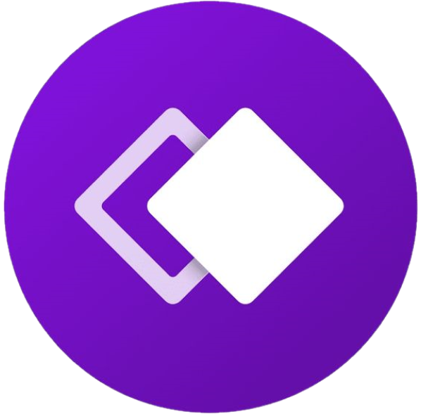

# GloBot

# What Is GloBot?

**GloBot is a Slack app that allows the user to interact with a bot and receive an updated list of upcoming networking events hosted by GlobalPDX. It was created using PostgreSQL, Express, JavaScript, Node.js, and various npm modules**

# Where data is collected from: GlobalPDX  

# Built with

      

# Triggered By

| Command | Description                         |
| ------- | ----------------------------------- |
| /events | Returns a list of networking events |

# GloBot Team

Jake Doherty:  
 | 

Hana Acciaioli:  
 | 

Tyler Watson:  
 | 

Tom Booth:  
 | 

Dylan Flanagan:  
 | 

# The Plan

# To Use GloBot

1: Open Slack (you got this)  
2: Install GloBot to workspace  
3: Add Bot to #Events channel  
4: Enter /events command into #Events channel
